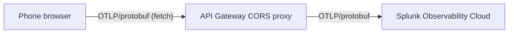

# Improvement Opportunities

Each item follows the structure: **Why** (rationale) and **How** (implementation steps). Items are grouped thematically.

---

## Code Quality

### Enable TypeScript strict mode

**Why**
[`tsconfig.json`](../tsconfig.json) was generated with `tsc --init` and has all strict checks commented out. Several existing patterns — unguarded `getElementById` calls, implicit `any` on `KalmanFilter`, unobserved gauges — would be caught immediately with strict mode enabled. Fixing them raises confidence that the compiled output behaves as intended.

**How**
1. In [`tsconfig.json`](../tsconfig.json) enable `"strict": true`, `"noImplicitAny": true`, and `"noUnusedLocals": true`.
2. Run `npx tsc --noEmit` and work through the resulting errors in [`motion_capture.ts`](../motion_capture.ts).
3. Add `@types/kalmanjs` or a local `declare module 'kalmanjs'` shim to resolve the `// @ts-ignore` on line 8.
4. Add `npx tsc --noEmit` as a pre-build step in the `"build"` script in [`package.json`](../package.json).

---

### Add ESLint and Prettier

**Why**
There is no linting or formatting tool in the project. Inconsistent code style slows reviews; ESLint catches common JS/TS pitfalls (e.g. floating promises, unused variables) that TypeScript alone does not flag.

**How**
1. `npm install --save-dev eslint @typescript-eslint/parser @typescript-eslint/eslint-plugin prettier eslint-config-prettier`.
2. Add `.eslintrc.json` targeting `@typescript-eslint/recommended` plus `eslint:recommended`.
3. Add `.prettierrc` with project preferences (single quotes, 100-char line length, tabs).
4. Add `"lint": "eslint motion_capture.ts"` and `"format": "prettier --write ."` to [`package.json`](../package.json) scripts.
5. Run in CI (see Build & Deploy section).

---

### Stop committing the compiled bundle

**Why**
[`motion_capture.js`](../motion_capture.js) (314 KB) is a build artefact generated from [`motion_capture.ts`](../motion_capture.ts). Committing it clutters diffs, makes the repo larger than necessary, and creates an opportunity for the compiled file to go out of sync with the source. The current deploy strategy (bump version string to trigger a rebuild) confirms this is a workaround rather than an intentional choice.

**How**
1. Add `motion_capture.js` to [`.gitignore`](../.gitignore).
2. Produce the bundle in CI (see Build & Deploy section).
3. Remove the file from the repo history once CI is wiring it into the deploy artefact.

---

## Build & Deploy

### Add a GitHub Actions CI/CD workflow

**Why**
The current deploy method is bumping a version constant in [`motion_capture.ts`](../motion_capture.ts) and pushing — the entire commit history is `updated version to trigger deploy`. There is no build validation, no linting, and no automated publish step. A GitHub Actions workflow would eliminate manual steps, ensure the bundle is always in sync with source, and make failures visible before they reach users.

**How**
1. Create `.github/workflows/deploy.yml`.
2. Trigger on push to `main`.
3. Steps: `actions/checkout`, `actions/setup-node`, `npm ci`, `npm run lint`, `npx tsc --noEmit`, `npm run build`, then `actions/upload-pages-artifact` + `actions/deploy-pages` to publish to GitHub Pages.
4. Remove the manual version-bump practice; use the git SHA or a proper semver tag for versioning instead.

---

### Externalise the API Gateway endpoint URL

**Why**
The endpoint `https://aior8w88kh.execute-api.eu-west-1.amazonaws.com/otlp/` is hard-coded in [`motion_capture.ts`](../motion_capture.ts) line 53. This couples every environment (dev, staging, prod) to a single gateway, prevents testing against a local mock, and embeds infrastructure details in source.

**How**
1. Pass the URL at build time via esbuild's `--define` flag:
   `esbuild ... --define:ENDPOINT_URL='"$OTLP_ENDPOINT"'`.
2. Declare `declare const ENDPOINT_URL: string;` at the top of [`motion_capture.ts`](../motion_capture.ts) and replace the hard-coded string with `ENDPOINT_URL`.
3. Set `OTLP_ENDPOINT` as a GitHub Actions environment variable (or repository secret).
4. Update [`setup.sh`](../setup.sh) with a local default for developer convenience.

---

## Telemetry Pipeline

### Switch from `ObservableGauge` to synchronous `Gauge`

**Why**
`ObservableGauge` is designed for values that are read on demand (e.g. current memory usage). For sensor readings that are pushed at a fixed rate, the synchronous `Gauge` instrument is more appropriate: call `.record(value)` each time a reading arrives, with no callback machinery. This also eliminates the callback-leak bug (see bug-fixes plan, item 2).

**How**
1. Replace each `meter.createObservableGauge(...)` call in [`motion_capture.ts`](../motion_capture.ts) lines 80–89 with `meter.createGauge(...)`.
2. In the interval/event handlers, call `metrics.g.record(gForce)` instead of updating a shared variable.
3. Remove the callback registration block from `startTelemetry()`.

---

### Add a Histogram for g-force

**Why**
A single gauge reports the value chosen at export time (min or max of the sample window). A `Histogram` retains the full distribution — p50, p95, p99 — letting Splunk dashboards answer "how often did this player exceed 3 g?" rather than just "what was the last reading?".

**How**
1. Add `metrics.gHist = meter.createHistogram("g_force", { boundaries: [0.5, 1, 1.5, 2, 3, 5] })`.
2. In the `devicemotion` handler, call `metrics.gHist.record(gForce)` for every sample.
3. Keep the gauge alongside it if a "latest value" readout is still needed in Splunk.

---

### Emit the accelerometer X, Y, Z axes

**Why**
`metrics.x`, `metrics.y`, `metrics.z` are created in [`motion_capture.ts`](../motion_capture.ts) lines 80–82 but are never observed (the `addCallback` lines 172–174 are commented out). Axis-level data is useful for gesture recognition and orientation analytics.

**How**
1. After fixing the g-force formula (bug-fixes item 1), store `a.x`, `a.y`, `a.z` in module-scoped latest-value variables.
2. Register callbacks once (or call `.record()`) for `metrics.x/y/z` alongside the other instruments.
3. Update the UI readout block (currently commented out at lines 166–168) to display axis values.

---

### Add OpenTelemetry traces

**Why**
Currently only metrics are exported. Traces add a causal dimension: a single "session" span with child spans per export batch lets Splunk APM show timing, gaps, and errors in the telemetry pipeline itself — e.g. how long each GPS lock takes, or where export failures cluster.

**How**
1. `npm install @opentelemetry/sdk-trace-web @opentelemetry/exporter-trace-otlp-http`.
2. Initialise a `WebTracerProvider` alongside the `MeterProvider` in `startTelemetry()`.
3. Create a root `session` span on Start; create child spans for each sensor reading batch.
4. End the root span in `stopTelemetry()`.
5. The AWS API Gateway already proxies OTLP/HTTP; add the traces endpoint (`/v1/traces`) as a second route.

---

### Buffer failed exports to IndexedDB

**Why**
On a mobile network (tunnels, dead zones) the OTel exporter silently drops failed batches. For a telemetry PoC capturing physical events this means unrecoverable data loss. Buffering to `IndexedDB` and replaying on reconnect preserves continuity.

**How**
1. Wrap `OTLPMetricExporter` in a custom exporter class that catches export errors and writes the serialised payload to `IndexedDB`.
2. On successful connection (or on page load), drain the `IndexedDB` queue and re-export in order.
3. Cap the buffer size (e.g. 1000 data points) and emit a UI warning when the buffer is non-empty.
4. Use the [Network Information API](https://developer.mozilla.org/en-US/docs/Web/API/Network_Information_API) (`navigator.connection`) as a hint for when to retry.

---

### Evaluate OTLP/protobuf to simplify the API Gateway

**Why**
The README notes that `@opentelemetry/exporter-metrics-otlp-proto` "isn't supported in browsers", which is why the AWS API Gateway + VTL transform was introduced to convert OTLP/JSON to the SignalFx `/v2/datapoint` format. The `@opentelemetry/otlp-transformer` package and the `fetch` API together make it feasible to send OTLP/protobuf from a browser today, targeting Splunk's native OTLP endpoint directly. If this works, the VTL transformation in [`template.vtl`](../template.vtl) becomes unnecessary and the gateway becomes a thin CORS proxy.



**How**
1. Spike: replace `OTLPMetricExporter` with a custom exporter using `@opentelemetry/otlp-transformer` to serialise to protobuf and `fetch` with `Content-Type: application/x-protobuf`.
2. Test against the Splunk OTLP metrics endpoint (`https://ingest.<realm>.signalfx.com/v2/datapoint/otlp`).
3. If successful, update the API Gateway to a `HTTP_PROXY` integration (no mapping template) and retire [`template.vtl`](../template.vtl).
4. If not feasible (browser protobuf issues), document the finding and keep the current JSON + VTL path.

---

## Configuration UI

### Make intervals and Kalman parameters configurable

**Why**
`exportIntervalMillis` is hard-coded to 1000 ms in [`motion_capture.ts`](../motion_capture.ts) line 65, `gpsInterval` is fixed at 500 ms (line 39), and the Kalman filter coefficients `R: 0.1, Q: 2` (lines 33–34) are constants. Changing any of them requires a code rebuild. For a PoC used in demonstrations, adjusting these live is valuable.

**How**
1. Add numeric inputs to [`index.html`](../index.html) for "Export interval (ms)" and optionally "GPS cache age (ms)".
2. Pass the values into `createExporter()` and the `watchPosition` options.
3. For Kalman `R`/`Q`, expose them as query-string parameters (e.g. `?kalman_r=0.1&kalman_q=2`) so they can be tuned without touching the UI.

---

### Persist user inputs in `localStorage`

**Why**
The user must re-enter their name and interval every time the page is loaded. For repeated demo sessions this is friction.

**How**
1. On `input` events for the name and interval fields in [`index.html`](../index.html), write values to `localStorage`.
2. On page load in [`motion_capture.ts`](../motion_capture.ts), read and pre-fill the inputs.
3. Clear on an explicit "Reset" button if desired.

---

## Sensor Quality

### Calibrate gyroscope on telemetry start

**Why**
This is an open TODO in [README.md](../README.md). Raw `DeviceOrientationEvent` values include sensor bias (drift at rest). Without calibration, the alpha/beta/gamma readings in Splunk have an unknown offset that changes device-to-device, making cross-device comparison unreliable.

**How**
1. On "Start Sensors", before beginning normal data collection, enter a 1-second calibration phase.
2. Collect ~20 `deviceorientation` samples; compute the mean alpha, beta, gamma.
3. Store the offsets as module-scoped constants.
4. Subtract the offsets from all subsequent readings before updating latest values.
5. Display "Calibrating..." in the gyro readout during the phase.

---

### Treat `null` accelerometer values as drop-outs

**Why**
`event.acceleration` can have `null` components (particularly on some Android devices at rest). The current code substitutes `0` (via `?? 0`), which skews the g-force computation downward and produces false "zero motion" data points.

**How**
1. If all three axes are `null`, skip the sample entirely rather than pushing `0` to `gForceSamples`.
2. Track a `droppedSamples` counter; expose it in the UI or as a metric for debugging.

---

## UX

### Connection and health indicator

**Why**
The app gives no feedback about whether data is reaching Splunk. A failing export looks identical to a successful one from the user's perspective.

**How**
1. Add a small status bar to [`index.html`](../index.html) showing: last successful export timestamp, pending queue size, and a coloured dot (green/amber/red).
2. Hook into the exporter's success/failure callbacks to update the status bar.
3. Use the `'online'`/`'offline'` window events to show a "No network" state.

---

### GPS trail map

**Why**
A real-time map preview makes the PoC visually compelling for demos and immediately confirms GPS is working without needing to open Splunk.

**How**
1. Add [Leaflet](https://leafletjs.com/) via `npm install leaflet` (or a CDN link with SRI hash).
2. Add a `<div id="map">` to [`index.html`](../index.html).
3. On each GPS update, append a point to a `L.polyline` and pan the map to the latest position.
4. Use OpenStreetMap tiles (free, no API key) with an offline tile cache using `Cache Storage` for resilience.

---

### Graceful degradation when geolocation is denied

**Why**
If the user denies location permission, the entire Start flow in [`motion_capture.ts`](../motion_capture.ts) lines 96–137 shows an alert and stops. Motion and orientation sensors are still useful without GPS (e.g. indoor use, gesture demos).

**How**
1. On geolocation denial, call `startTracking()` without the GPS watcher rather than aborting.
2. Show a non-blocking banner: "GPS unavailable — motion data only".
3. The GPS metric gauges will simply not be observed; OTel will not emit them.

---

### Document HTTPS requirement in README

**Why**
`DeviceMotionEvent.requestPermission()` and `navigator.wakeLock` both require a secure context (HTTPS). Developers who clone the repo and try `http-server` locally will get silent failures with no obvious explanation.

**How**
1. Add a "Requirements" section to [README.md](../README.md) noting that HTTPS is required on iOS for motion permission and for Wake Lock on all platforms.
2. Document that the `server.sh` Python server is HTTP-only and suitable for Android testing on the same LAN but not for iOS.
3. Suggest using `npx local-ssl-proxy` or GitHub Pages for iOS testing.

---

## Infrastructure as Code

### Version the API Gateway configuration

**Why**
Only [`template.vtl`](../template.vtl) is in this repo. The API Gateway route, method, integration, stage, CORS configuration, and stage variables exist only in the AWS console. If the gateway were deleted or if a second environment were needed, it could not be recreated from source. This is a direct gap identified in [README.md](../README.md) ("Save api gateway config to this repo").

**How**
1. Export the current API Gateway as an OpenAPI JSON/YAML definition from the AWS Console.
2. Add it to the repo as `infra/api-gateway.yaml`.
3. Alternatively, author a `template.yaml` (AWS SAM) or `main.tf` (Terraform) that creates the HTTP API, the Lambda proxy or mapping template integration, the CORS config, and the stage with variable references.
4. Document deploy steps in README.

---

### Move the SignalFx ingest token to Secrets Manager

**Why**
Storing the token as a plain API Gateway stage variable means it is visible in the AWS Console to anyone with `apigateway:GET` permission and is not rotated automatically. AWS Secrets Manager or SSM Parameter Store provide audit trails, access control, and rotation hooks.

**How**
1. Store the token in AWS SSM Parameter Store as a `SecureString` (`/telemetry/splunk-ingest-token`).
2. In the API Gateway integration (or a thin Lambda proxy), resolve the token at request time via `ssm:GetParameter`.
3. Remove the plain-text stage variable.
4. Rotate the token on a schedule using an SSM rotation Lambda or manually via the Secrets Manager console.

---

### Add API Gateway access logging with PII redaction

**Why**
There are currently no access logs on the gateway. Without them there is no visibility into request errors, latency, or abuse. The gateway receives GPS coordinates (latitude/longitude) which are PII — logging them in full would violate data minimisation principles (see repo's `codeguard-0-privacy-data-protection` rule).

**How**
1. Enable CloudWatch access logging on the API Gateway stage.
2. Use a log format that includes `requestId`, `status`, `responseLength`, `requestTime`, and `userAgent`, but excludes the request body (which contains coordinates).
3. Set a CloudWatch log retention policy (e.g. 30 days).
4. Add a CloudWatch alarm on 4xx/5xx error rate > 5%.

---

## Security Headers

### Add HTTP security headers to static hosting

**Why**
[`index.html`](../index.html) is served from GitHub Pages with no custom response headers. The app accesses device sensors and location, making it a target for clickjacking and injection. The repo's `codeguard-0-client-side-web-security` rule requires CSP, `X-Content-Type-Options`, `Referrer-Policy`, and `Permissions-Policy`.

**How**
1. Add a `_headers` file at the repo root (Netlify/Cloudflare Pages syntax) or configure GitHub Pages headers via a custom server if self-hosting.
2. Target headers:
   ```
   Content-Security-Policy: default-src 'self'; connect-src 'self' https://aior8w88kh.execute-api.eu-west-1.amazonaws.com; script-src 'self'; style-src 'self'; frame-ancestors 'none'
   X-Content-Type-Options: nosniff
   Referrer-Policy: no-referrer
   Permissions-Policy: geolocation=(), gyroscope=(), accelerometer=()
   ```
3. Move the inline `<style>` block in [`index.html`](../index.html) to a separate `style.css` file so `style-src 'self'` works without `'unsafe-inline'`.
4. Validate headers with [securityheaders.com](https://securityheaders.com) after deploy.

---

## Testing

### Unit-test pure functions

**Why**
There are zero tests. The most valuable starting point is testing the pure computation functions: g-force calculation, max-speed reduction, and Kalman filter wiring. These are side-effect free and easy to cover.

**How**
1. `npm install --save-dev vitest` (works with esbuild/TypeScript projects without separate Jest config).
2. Extract `computeGForce(x, y, z): number` and `computeMaxSpeed(positions): number` as pure functions from [`motion_capture.ts`](../motion_capture.ts).
3. Write `motion_capture.test.ts` covering: g-force at rest (~1.0), g-force at zero (~0), max-speed with mixed valid/null values.
4. Add `"test": "vitest run"` to [`package.json`](../package.json) and run in CI.

---

### VTL fixture test

**Why**
The API Gateway transform in [`template.vtl`](../template.vtl) is the most fragile piece of the pipeline — a syntax error there silently drops all metrics. The repo already contains a matching pair of input ([`test files/otlp.json`](../test%20files/otlp.json)) and expected output ([`test files/o11y.json`](../test%20files/o11y.json)) that could be turned into an automated fixture test.

**How**
1. `npm install --save-dev velocityjs` (a JS implementation of Apache Velocity).
2. Write a test that renders [`template.vtl`](../template.vtl) with [`test files/otlp.json`](../test%20files/otlp.json) as the mock `$input` and asserts the result matches [`test files/o11y.json`](../test%20files/o11y.json).
3. Run this test in CI alongside the unit tests; a failing VTL render blocks deploy.

---

### Build-time type check in CI

**Why**
esbuild transpiles TypeScript by stripping types — it does not type-check. TypeScript errors go undetected unless `tsc --noEmit` is run separately. Currently it is not run at all.

**How**
1. Add `"typecheck": "tsc --noEmit"` to [`package.json`](../package.json) scripts.
2. Run it as a step before `npm run build` in the GitHub Actions workflow.
3. This pairs with the strict-mode improvement above to surface latent type errors before they ship.
